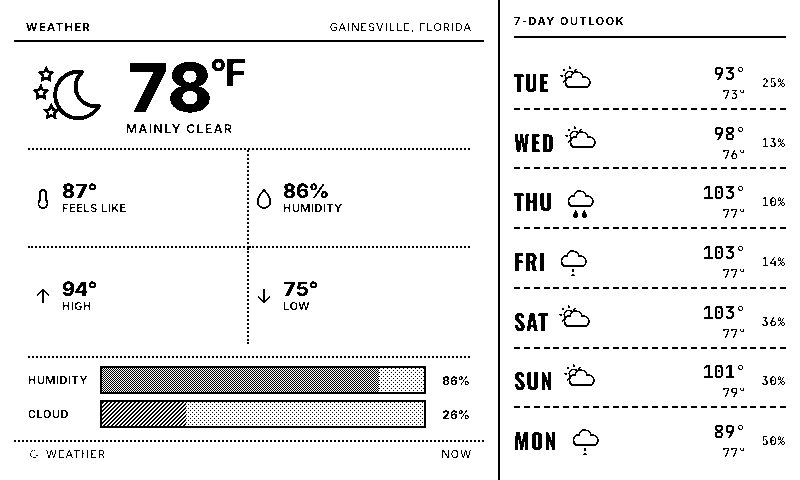

# E-Ink Dashboard

A server-rendered, newspaper-style dashboard for the Waveshare 7.5" e-paper display + ESP32.

The server renders your dashboard as HTML, screenshots it to an 800×480 1-bit image, and serves it to the ESP32. You arrange widgets, edit content, and schedule screens from a phone-friendly control panel.

[](https://railway.com/new/github/hqn07/eink-dashboard)

No API keys required — weather comes from Open-Meteo (free, keyless).


<p align="center">
  
  
</p>

*Panel-accurate renders straight from the server (`/display-3c.png`) — what you see is what the e-paper draws.*

---

## What you get

- **27 widgets**: weather (current + forecast), clock, world clock, calendar (multi-iCal), tasks (Todoist/iCal), transit, headlines, quote, word of the day, countdown, day/week/month/year progress bars, photo (Floyd–Steinberg dithered), WiFi QR, stocks / crypto / FX sparklines, air quality, moon (real dithered NASA photo), sunrise/sunset, GitHub contribution heatmap, battery, Mac now-playing, text/token bar, **webhook** (POST any JSON, it renders on the panel — TRMNL-private-plugin style).
- **Unlimited screens** with per-screen layout, schedule, and chrome (header / footer).
- **Live editor** — drag-resize widgets directly on the preview, no mode toggle.
- **Tier-aware layouts** — every widget has a deliberate compact / standard / extended / full layout. Resize freely; the widget always picks a layout that fits.
- **Screen presets** — Editorial, Wake Up, Bedside, Photo Wall, Office, Quote Card, Status Board…
- **Per-tile customization** — border style, visibility schedule, flush-edge mode.
- **Self-hosted fonts** — no Google Fonts dependency at runtime.
- **All-1-bit** — pure black/white render path tuned for the actual physical panel, not just the browser preview.
- **3-color (B/W/red) panel support** — two-plane binary, red-accent classifier, panel-accurate preview.
- **Dither system** — ordered-dither tone ramp (7 grays from 1-bit ink) + equal-darkness texture weaves (diagonal / lines / cross-hatch) so adjacent fills read apart on paper.
- **Fleet-ready device API** — per-device enrollment + API keys, per-device screen assignment, OTA firmware updates from CI, RTC-buffered device event log (failures report themselves on recovery).
- **Zero-touch WiFi setup** — captive portal on first boot (multi-network store), warm-boot fast reconnect (~700 ms), exponential failure backoff, battery telemetry.

---

## Architecture

```
[Phone/laptop] --edits--> [Control panel /control]
                              |
                              v
                          [config.json]
                              |
                              v
                   [Dashboard HTML /dashboard]
                              |
                       (Puppeteer screenshot + Sharp threshold)
                              |
                              v
              [/display.png  +  /display.bin]
                              ^
                              |
              [ESP32 wakes every N min → downloads .bin → renders → sleeps]
```

The ESP32 firmware is intentionally "dumb": it knows how to download a 48000-byte 1-bit image and push it to the display. All layout, fonts, and data fetching happens server-side.

---

## Quick start

### Local

```bash
git clone https://github.com/hqn07/eink-dashboard
cd eink-dashboard
npm install
npm start
```

Visit:
- **http://localhost:3000/control** — control panel
- **http://localhost:3000/dashboard** — live HTML preview (what gets screenshot)
- **http://localhost:3000/display.png** — the rendered 1-bit image the ESP32 will get
- **http://localhost:3000/widgets-matrix** — visual QA page showing every widget at every preset size

If `display.png` looks right, you're 90% done.

### Railway

1. Click the **Deploy on Railway** button above (or push to your own GitHub and connect manually).
2. Wait ~2 min for the build.
3. Click **Settings → Networking → Generate Domain**.
4. Visit `https://<your-app>.up.railway.app/control`.

Optional environment variables:
- `DEVICE_TOKEN` — secret string. If set, the ESP32 must include `?token=<value>` (or `X-Device-Token` header) to hit `/display.bin`. Lock down the device endpoints.
- `PORT` — auto-provided by Railway. Leave alone.

---

## Flash the firmware

1. Copy `esp32/weather_station/secrets.h.example` to `secrets.h`, set your server URL + device token (WiFi is NOT hardcoded — see step 4).
2. Open `esp32/weather_station/weather_station.ino` (BW panel) or `esp32/weather_station_b/` (3-color) in Arduino IDE.
3. Upload to the ESP32 driver board (ESP32 Dev Module, 115200 baud).
4. On first boot the device opens a captive-portal AP named `eink-setup` — join it from your phone and pick your WiFi. Credentials persist; the portal never shows again.
5. Done. The device enrolls itself against the server, downloads the image, and deep-sleeps between refreshes. Firmware updates arrive over the air from CI builds.

Button gestures: tap = refresh now · hold 2–7 s = reopen WiFi portal · hold 10 s = factory reset.

---

## File map

```
server.js                Composition root: middleware + mounts routes/*.js.
lib/                     Server modules — render (Puppeteer + image cache),
                         image (1-bit + 3-color plane pipeline), screens,
                         auth, refresh cadence, SSR, widget-data fan-out,
                         config/battery/devices/logs/webhook stores.
routes/                  Express routers, one per group: display, config,
                         devices, firmware, webhook, alarms, battery, auth…
widgets/                 Server-side data fetchers (one file per widget).

control-src/             React control panel source (Vite).
  widgets/               Per-widget module pairs: <id>.js (def + render,
                         shared with server SSR) + <id>.form.jsx (settings).
  face-css/              Numbered partials → built into public/dashboard.css.
  components/            Editor primitives.

public/
  dashboard.css          GENERATED from control-src/face-css/ — don't hand-edit.
  fonts/                 Self-hosted WOFF2s.
  control-app/           Built React editor (Vite output).
  firmware/              CI-built OTA binaries (bw-x.y.z.bin / b-x.y.z.bin).

esp32/
  weather_station/       BW panel firmware (captive portal, OTA, deep sleep).
  weather_station_b/     3-color panel firmware (two-plane image path).

scripts/                 build-face-css, eink-lint, check-widgets,
                         visual-regression (1-bit snapshot of every widget).
```

---

## Customizing the look

Edit `public/dashboard.css`. Open `http://localhost:3000/dashboard` in your browser to preview instantly — no reflash needed.

**E-ink rules** (things that look fine in a browser but break on real hardware):
- The display is 1-bit. Use **pure `#000` and `#fff`** only — any `opacity`, `rgba`, or grey dithers into noisy stipple.
- **Minimum 11px** fonts. Sub-11 strokes vanish on the panel.
- **Minimum 1.5px** borders. Thin 1px borders sometimes drop.
- Stick to bold, condensed fonts. Thin weights disappear.
- `<body>` is locked to 800×480.

When in doubt, photograph the physical panel before declaring a render "fine".

---

## Adding a widget

A widget is one module pair in `control-src/widgets/`:

1. **`<id>.js`** — exports `def` (sizes, defaults, variants) + `render(ctx)` (pure JS string template). The same render runs in the editor, the preview, and the server SSR — one source of truth, no drift.
2. **`<id>.form.jsx`** — the React settings form for the widget modal.
3. Register it in `_registry.js`, `_ssr.js`, and the palette (`control-src/widgets.js`); add a server-side data fetcher in `widgets/<id>.js` + a `perItem` case in `lib/widget-data.js` if it needs data.

`npm run check:widgets` statically verifies all wiring spots — a widget can't half-exist. Use `pickTier(cellW, cellH)` and branch on `tiny / compact / standard / extended / full`; set `minSize` so the editor can't shrink below a known-good floor.

See [CONTRIBUTING.md](CONTRIBUTING.md) for more.

---

## Hardware

See [BOM.md](BOM.md) for the parts list, GPIO pinout, and assembly notes. Estimated build cost: **$55–80 USD**.

## Design docs

- [docs/multitenant-architecture.md](docs/multitenant-architecture.md) — design for the eventual multi-tenant SaaS model (accounts, per-device config, claim flow). Not built; the keystone is moving config from file to a database.
- [docs/device-api.md](docs/device-api.md) — the device ↔ server HTTP contract.

---

## License

MIT. See [LICENSE](LICENSE).

## Contributing

PRs welcome. See [CONTRIBUTING.md](CONTRIBUTING.md) for scope, dev setup, widget anatomy, and the e-ink rules of thumb.
